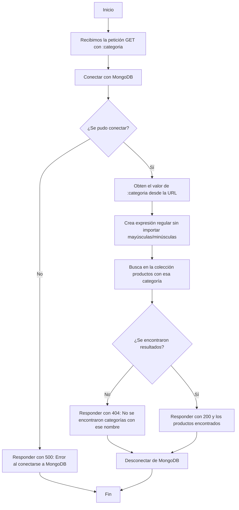

# API.SUPERMERCADO 🛍️🛒 

Esta API RESTful permite gestionar un inventario de productos de supermercado. Su nombre es __"API.SUPERMERCADO"__. Proporciona endpoints para: consultar, agregar, actualizar, borrar e incluso buscar productos por su código o categoría. La base de datos utilizada es MongoDB.

---

## 📚 Librerías utilizadas

🟢 Node.js
🚂 Express
🍃 MongoDB
📦 Body-parser
🔐 Dotenv

---

## 🌱 Configuracion de entorno

Creamos un archivo **.env** en la raiz del proyecto, con las siguientes variables para que la aplicacion pueda funcionar correctamente.

* PORT
* MONGODB_URI
  
---

## 🔌 Conexion a la base de datos

Nuestro **server.js** se conecta a una base de datos MongoDB utilizando un modulo externo llamado **mongodb.js**, este archivo exporta dos funciones que son:

* connectToMongoDB()
* disconnectFromMongoDB()
  
Estas se utilizan dentro de cada ruta para asegurar que se conecte y desconecte de la base de datos MongoDB correctamente en cada solicitud.

## 🌐 Base URL

```
http://localhost:3008
```

---

## 📑 Endpoints

### 📍 GET /
__Descripción:__ Ruta de inicio que da la bienvenida a la API.

#### Ejemplo

__Método:__ GET

__URL:__ http://localhost:3008

##### 📤 Respuesta:
"🛒🛍️ Bienvenido a la API de Supermercado 🛍️🛒"


---

### 📦 Obtener todos los productos

**GET** `/productos`

__Descripción:__ Devuelve todos los productos del inventario.

#### Ejemplo
##### Respuesta exitosa: Código 200 y array JSON con productos.

__Método: GET__

__URL:__ http://localhost:3008/productos

```json
[
  {
    "_id": "665e...",
    "codigo": 1234,
    "nombre": "Arroz",
    "precio": 5.99,
    "categoria": "Comestible"
  }
]
```

---

### 🔍 Obtener el producto por codigo

**GET** `/productos/codigo/:codigo`

__Descripción:__ Devuelve un producto según su código.

#### Ejemplo
##### Parámetro requerido: 
codigo (numérico)
##### Respuesta exitosa: Código 200 y un producto.

__Método:__ GET

__URL:__ http://localhost:3008/productos/codigo/1234

```json
{
    "_id": "665e...",
    "codigo": 1234,
    "nombre": "Arroz",
    "precio": 5.99,
    "categoria": "Comestible"
}
```
##### Respuesta si no se encuentra:
```
{
  "error": "Producto no encontrado"
}
```
##### Respuestas erróneas:
###### Código no numérico:

__Método:__ GET

__URL:__ http://localhost:3008/productos/codigo/abc

__Respuesta:__
```json
{
  "error": "El código debe ser un número válido"
}
```
__Código HTTP: 400__
###### Producto no encontrado:

__Método:__ GET

__URL:__ http://localhost:3008/productos/codigo/9999

__Respuesta:__
```json
{
  "message": "Producto no encontrado"
}
```
__Código HTTP: 404__


---

### 🔍 Obtener producto por categoria

**GET** `/productos/categoria/:categoria`

__URL:__ http://localhost:3008/productos/categoria/:categoria

* **Descripcion**: Busca un productos por su categoria, sin distinguir mayusculas y minusculas, pero si distingue los acentos.
  
### Parametros:

* `:categoria`: es un string de busqueda extacta **(limpieza, infusiones, comestible, panadería, frutas, especias, lácteos, higiene personal, bebidas, electrodomésticos)**.

### Respuesta:

* `500`: Error al conectarse a MongoDB.
* `200`: Lista de productos encontrados por categoria.
* `404`: No se encontraron categorias con ese nombre.
* `500`: Ocurrio un error interno en el servidor.

#### 🗺️ Diagrama de como funciona



#### Ejemplo de respuesta:

```json
[
  {
    "_id": "68445..",
    "codigo": 9012,
    "nombre": "Detergente",
    "precio": 8.75,
    "categoria": "Limpieza"
  },
  {
    "_id": "6844..",
    "codigo": 6789,
    "nombre": "Jabón de manos",
    "precio": 2.49,
    "categoria": "Limpieza"
  }
]

[
  {
    "_id": "68445efda8b3db1fd7035fe0",
    "codigo": 1098,
    "nombre": "Limones",
    "precio": 1.99,
    "categoria": "Frutas"
  },
  {
    "_id": "68445efda8b3db1fd7035fe3",
    "codigo": 2109,
    "nombre": "Naranjas",
    "precio": 2.99,
    "categoria": "Frutas"
  },
  {
    "_id": "68445efda8b3db1fd7035fcf",
    "codigo": 8745,
    "nombre": "Manzanas",
    "precio": 3.99,
    "categoria": "Frutas"
  }
]
```

---

### ➕ Crear un nuevo producto

**POST** `/productos`

* **Descripcion**: Con la siguiente funcion se genera un numero aleatorio entre 0 y 9999, verifica i ya existe y repite el proceso hasta encontrar un numero disponible.

```javascript
async function generarCodigoUnico() {
  let codigo;
  let existe = true;

  while (existe) {
    codigo = Math.floor(Math.random() * 10000);
    const codigoExistente = await inventario.findOne({ codigo });
    if (!codigoExistente) {
       existe = false;
      }
  }

  return codigo;
}

nuevoProducto.codigo = await generarCodigoUnico()
```
Tambien se hizo un **if** que hace un **return status 400** si se envia un objeto vacio y otro que dice que **si no tiene nombre, precio y categoria** haga tambien un **return status 400**.

```javascript
if (!nuevoProducto || Object.keys(nuevoProducto).length === 0){
  return res.status(400).json({ error: "El formato de datos recibidos esta vacio"}); 
}
    
if (!nuevoProducto.nombre || !nuevoProducto.nombre.trim() || typeof nuevoProducto.precio !== "number" || isNaN(nuevoProducto.precio) || !nuevoProducto.categoria || !nuevoProducto.categoria.trim()) {
  return res.status(400).json({ error: "Se necesitan los campos nombre (texto), precio (número) y categoría (texto)"});
}
```

* **body (JSON)**:
  
```json
{
    "nombre": "Lavandina",
    "precio": 8.75,
    "categoria": "Limpieza",
    "codigo": 1388,
    "_id": "6849..."
}

{
    "nombre": "Medialunas",
    "precio": 8.75,
    "categoria": "Panadería",
    "codigo": 4953,
    "_id": "6849..."
}

```

### Respuesta: 

* `400`: El formato de datos recibidos esta vacio.
* `400`: Se necesitan los campos nombre (texto), precio (número) y categoría (texto).
* `500`: Error al conectarse a MongoDB.
* `200` Se pudo crear el producto.
* `409`: El producto ya existe.
* `500`: Ocurrio un error interno en el servidor.
  
---

### 🛠️ Modificar un producto

**PUT** `/productos/codigo/:codigo`

__Descripción:__ Actualiza los datos de un producto según su código.

* NOTA: No se puede modificar el campo `_id`.

#### Ejemplos
##### Parámetro requerido: 
codigo (numérico)

__Método:__ PUT

__URL:__ http://localhost:3000/productos/codigo/1234

__Body (JSON):__
```json
{
  "nombre": "Pan Integral",
  "precio": 150,
  "categoria": "Panadería"
}
```
##### Respuesta exitosa: Código 200 y el producto actualizado.
```json
{
  "nombre": "Pan Integral",
  "precio": 150,
  "categoria": "Panadería"
}
```
##### Respuestas erróneas:
###### Código no numérico:

__Método:__ PUT

__URL:__ http://localhost:3008/productos/codigo/abcd

__Respuesta:__
```json
{
  "error": "El código debe ser un número válido"
}
```
__Código HTTP: 400__
###### Cuerpo vacío:

Petición con body vacío {}

__Respuesta:__
Error en el formato de datos recibidos.

__Código HTTP: 400 (texto plano)__
###### Producto no encontrado:

__Método:__ PUT

__URL:__ http://localhost:3008/productos/codigo/1234

__Respuesta:__
Producto no encontrado.
###### Error interno inesperado (por ejemplo, MongoDB no disponible):
__Respuesta:__

```json
{
  "error": "Ocurrio un error interno en el servidor"
}
```
__Código HTTP: 500__

---

## Tabla de resumen de respuestas:
### Respuestas exitosas

| Método | Ruta                             | Descripción                        | Código HTTP | Ejemplo de respuesta               |
| ------ | -------------------------------- | ---------------------------------- | ----------- | ---------------------------------- |
| GET    | /productos                       | Lista todos los productos          | 200         | Array de productos JSON            |
| GET    | /productos/codigo/:codigo        | Devuelve un producto por su código | 200         | Objeto JSON del producto           |
| PUT    | /productos/codigo/:codigo        | Actualiza un producto existente    | 200         | Objeto JSON con datos actualizados |

---

### Respuestas con errores

| Método | Ruta                             | Caso de error                        | Código HTTP | Respuesta                                                       |
| ------ | -------------------------------- | ------------------------------------ | ----------- | --------------------------------------------------------------- |
| GET    | /productos/codigo/:codigo        | Código no numérico                   | 400         | `{ "error": "El código debe ser un número válido" }`            |
| GET    | /productos/codigo/:codigo        | Producto no encontrado               | 404         | `{ "message": "Producto no encontrado" }`                       |
| PUT    | /productos/codigo/:codigo        | Código no numérico                   | 400         | `{ "error": "El código debe ser un número válido" }`            |
| PUT    | /productos/codigo/:codigo        | Cuerpo vacío                         | 400         | `Error en el formato de datos recibidos.`                       |
| PUT    | /productos/codigo/:codigo        | Producto no encontrado               | 404         | `Producto no encontrado.`                                       |

---

